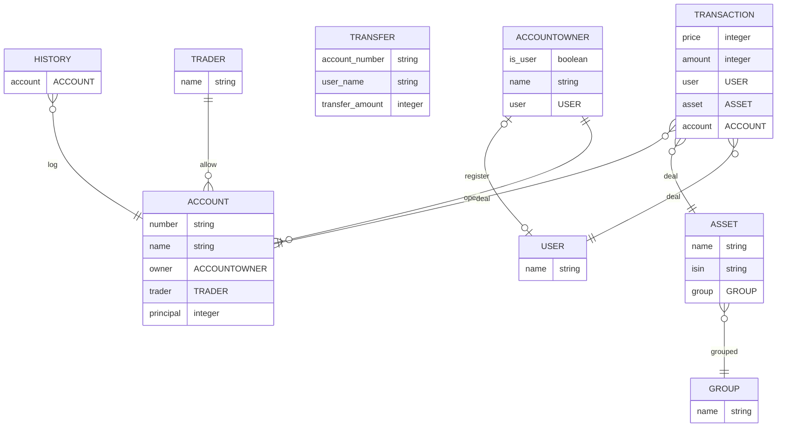

# user-invest-data

디셈버앤컴퍼니 핀트 서비스 개발

## 목차

- [user-invest-data](#user-invest-data)
  - [목차](#목차)
  - [멤버소개](#멤버소개)
  - [프로젝트 요구사항](#프로젝트-요구사항)
  - [Batch Scripts](#batch-scripts)
  - [ER Diagram](#er-diagram)
    - [accounts](#accounts)
    - [assets](#assets)
    - [traders](#traders)
    - [transactions](#transactions)
    - [users](#users)
  - [API Docs](#api-docs)
    - [데이터 조회 (`invest` 앱)](#데이터-조회-invest-앱)
    - [투자금 입금 Phase 1](#투자금-입금-phase-1)
    - [투자금 입금 Phase 2](#투자금-입금-phase-2)

## 멤버소개

| 이름   | Github                        | Email                 | Blog                        |
| ------ | ----------------------------- | --------------------- | --------------------------- |
| 이찬행 | https://github.com/2chanhaeng | 2chanhaeng@gmail.com  | https://chomu.dev/          |
| 이호진 | https://github.com/HoJin9622  | kiss0104040@gmail.com | https://velog.io/@hojin9622 |
| 김동현 | https://github.com/xxddongxx  | hyeon2187@gmail.com   |                             |

## 프로젝트 요구사항

- [Figma](https://www.figma.com/file/scym2fxvkdhcgssf8UuuDI/%ED%95%80%ED%8A%B8-%EC%84%9C%EB%B9%84%EC%8A%A4%EA%B0%9C%EB%B0%9C-%EA%B3%BC%EC%A0%9C?node-id=0%3A1)의 각 화면에서 필요한 데이터를 고객에게 제공해주는 API 시스템을 개발
- 제공된 테스트 데이터 셋을 API에서 사용할 수 있또록 정제하여 로딩하는 batch script 작성
- 원본 데이터와 응답 값에 일관성을 유지

## Batch Scripts

```yml
on:
  schedule:
    - cron: "0 0 * * *"
```

Github Action을 이용하여 매일 12시 데이터베이스를 업데이트합니다.

```bash
# 자산 정보를 입력합니다.
python manage.py seed_assets
```

결과:<br />


```bash
# 계좌 자산 정보를 입력합니다.
python manage.py seed_transactions
```

결과:<br />


## ER Diagram



### accounts

- `Account`: 계좌 모델
  - `number`: 계좌번호
  - `name`: 계좌명
  - `owner`: 계좌 소유자
  - `trader`: 증권사
  - `principal`: 투자 원금
- `AccountOwner`: 계좌 소유자 모델
  - `is_user`: 계좌 소유자가 서비스 사용자인지 여부
  - `name`: 계좌 소유자 명
  - `user`: 사용자 (계좌 소유자가 서비스 사용자일 경우)
- `Transfer`: 입금 모델
  - `account_number`: 계좌번호
  - `user_name`: 사용자명
  - `transfer_amount`: 거래금액
- `History`: 계좌 거래 내역 모델
  - `account`: 계좌

### assets

- `Asset`: 자산 모델
  - `name`: 종목명
  - `isin`: 식별자
  - `group`: 자산군
- `Group`: 자산군 모델
  - `name`: 자산군 명

### traders

- `Trader`: 증권사 모델
  - `name`: 증권사명

### transactions

- `Transaction`: 거래 내역 모델
  - `price`: 개당 가격
  - `amount`: 수량
  - `user`: 소유 사용자
  - `asset`: 자산
  - `account`: 계좌

### users

- `User`: 사용자 모델
  - `name`: 사용자 명

## API Docs

### 데이터 조회 (`invest` 앱)

- 투자 화면

  - Method: GET
  - URL: /api/v1/invest/user/<int:user_pk>/
  - Response:
    ```json
    [
      {
        'name': 계좌명,
        'trader': 증권사,
        'number': 계좌번호,
        'total_profit': 계좌 총 자산,
      },
      ...
    ]
    ```

- 투자상세 화면

  - Method: GET
  - URL: /api/v1/invest/user/<int:user_pk>/account/<int:account_pk>/
  - Response:
    ```json
    {
      'name': 계좌명,
      'trader': 증권사ID,
      'number': 계좌번호,
      'total_assets': 계좌 총 자산,
      'principal': 투자 원금,
      'total_profit': 총 수익금,
      'profit_rate': 수익률
    }
    ```

- 보유종목 화면 API

  - Method: GET
  - URL: /api/v1/invest/user/<int:user_pk>/account/<int:account_pk>/assets/
  - Response:

    ```json
    {
      보유 종목의 자산군:
      [
        {
          'asset_name': 보유 종목명,
          'asset_price': 보유 종목의 평가 금액 (종목 보유 수량 * 종목 현재가),
          'asset_isin': 보유 종목 ISIN,
        },
        ...
      ]
      , ...
    }
    ```

### 투자금 입금 Phase 1

- Method: POST
- URL: api/v1/accounts/transfer/
- Description: 입금 거래 정보들을 서버에 등록합니다.
- Request Example
  ```json
  {
    "account_number": "123123",
    "user_name": "아이작",
    "transfer_amount": 1000
  }
  ```
- Response Example
  ```json
  {
    "transfer_identifier": 111
  }
  ```

### 투자금 입금 Phase 2

- Method: POST
- URL: api/v1/accounts/transfer/result/
- Description: Phase 1에서 등록한 거래정보를 검증 후 실제 고객의 자산을 업데이트합니다.
- Request Example
  ```json
  {
    "signature": "82b64b05dfe897e1c2bce88a62467c084d79365af1", // "123123아이작1000" 을 sha512 hash 한 값.
    "transfer_identifier": 111
  }
  ```
- Response Example
  ```json
  {
    "status": true
  }
  ```
