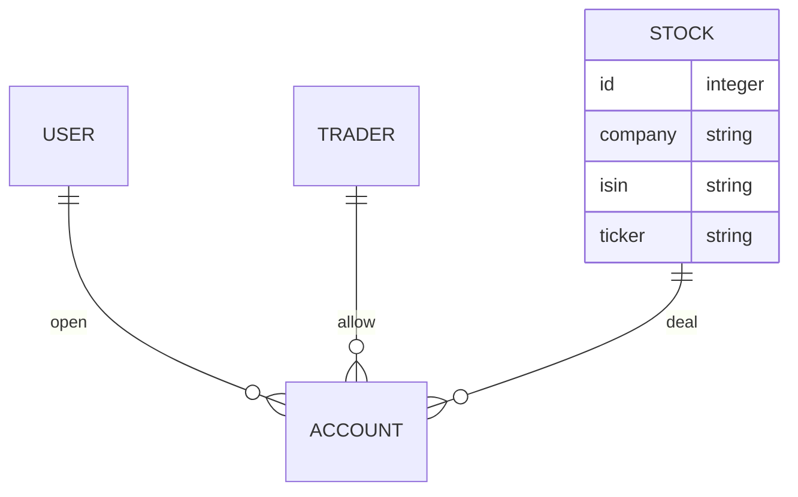

# user-invest-data

디셈버앤컴퍼니 핀트 서비스 개발

## 목차

- [user-invest-data](#user-invest-data)
  - [목차](#목차)
  - [멤버소개](#멤버소개)
  - [프로젝트 요구사항](#프로젝트-요구사항)
  - [ER Diagram](#er-diagram)
    - [accounts](#accounts)
    - [stocks](#stocks)
    - [traders](#traders)
    - [users](#users)
  - [API Docs](#api-docs)

## 멤버소개

|이름|Github|Email|Blog|
|---|---|---|---|
|이찬행|https://github.com/2chanhaeng|2chanhaeng@gmail.com|https://chomu.dev/|
|이호진|https://github.com/HoJin9622|kiss0104040@gmail.com|https://velog.io/@hojin9622|
|김동현|https://github.com/xxddongxx|hyeon2187@gmail.com||

## 프로젝트 요구사항

- 기존 운영서비스의 Backend 개발
- 기능 구현을 위한 DB 생성 : 계좌, 사용자, 주식, 증권사 등
- 정보 입력, 수정 시 데이터 형식의 유효성을 검사

## ER Diagram

### accounts

- 계좌 모델

### stocks

- 주식 모델
  - `id`: ID
  - `company`: 회사 이름
  - `isin`: ISIN 코드
  - `ticker`: 티커, 종목 식별 부호(약칭)

### traders

- 증권사 모델

### users

- 사용자 모델

## API Docs

<table>
  <thead>
    <tr>
      <th>App</th>
      <th>Method</th>
      <th>URL</th>
      <th>Permission</th>
      <th>Description</th>
    </tr>
  </thead>
  <tbody>
    <tr>
      <td rowspan=1>Accounts</td>
      <td></td>
      <td rowspan=1>/api/v1/accounts/</td>
      <td></td>
      <td></td>
    </tr>
    <tr>
      <td rowspan=1>Stocks</td>
      <td></td>
      <td rowspan=1>/api/v1/stocks/</td>
      <td></td>
      <td></td>
    </tr>
    <tr>
      <td rowspan=1>Traders</td>
      <td></td>
      <td rowspan=1>/api/v1/traders/</td>
      <td></td>
      <td></td>
    </tr>
    <tr>
      <td rowspan=1>Users</td>
      <td></td>
      <td rowspan=1>/api/v1/Users/</td>
      <td></td>
      <td></td>
    </tr>
  </tbody>
</table>
