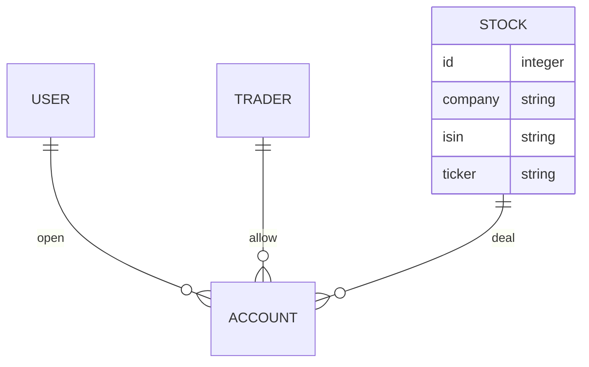

# user-invest-data

디셈버앤컴퍼니 핀트 서비스 개발

## 목차

- [user-invest-data](#user-invest-data)
  - [목차](#목차)
  - [멤버소개](#멤버소개)
  - [프로젝트 요구사항](#프로젝트-요구사항)
  - [Batch Scripts](#batch-scripts)
  - [ER Diagram](#er-diagram)
    - [accounts](#accounts)
    - [stocks](#stocks)
    - [traders](#traders)
    - [users](#users)
  - [API Docs](#api-docs)
    - [유저 계좌 조회](#유저-계좌-조회)
    - [보유 종목의 자산군 조회](#보유-종목의-자산군-조회)
    - [해당하는 자산군에 보유한 자산 조회](#해당하는-자산군에-보유한-자산-조회)
    - [투자 상세(미구현)](#투자-상세미구현)
    - [투자금 입금 Phase 1(미구현)](#투자금-입금-phase-1미구현)
    - [투자금 입금 Phase 2(미구현)](#투자금-입금-phase-2미구현)

## 멤버소개

| 이름   | Github                        | Email                 | Blog                        |
| ------ | ----------------------------- | --------------------- | --------------------------- |
| 이찬행 | https://github.com/2chanhaeng | 2chanhaeng@gmail.com  | https://chomu.dev/          |
| 이호진 | https://github.com/HoJin9622  | kiss0104040@gmail.com | https://velog.io/@hojin9622 |
| 김동현 | https://github.com/xxddongxx  | hyeon2187@gmail.com   |                             |

## 프로젝트 요구사항

- [Figma](https://www.figma.com/file/scym2fxvkdhcgssf8UuuDI/%ED%95%80%ED%8A%B8-%EC%84%9C%EB%B9%84%EC%8A%A4%EA%B0%9C%EB%B0%9C-%EA%B3%BC%EC%A0%9C?node-id=0%3A1)의 각 화면에서 필요한 데이터를 고객에게 제공해주는 API 시스템을 개발
- 제공된 테스트 데이터 셋을 API에서 사용할 수 있또록 정제하여 로딩하는 batch script 작성
- 원본 데이터와 응답 값에 일관성을 유지

## Batch Scripts

```yml
on:
  schedule:
    - cron: '0 0 * * *'
```

Github Action을 이용하여 매일 12시 데이터베이스를 업데이트합니다.

```bash
# 자산 정보를 입력합니다.
python manage.py seed_assets
```

결과:<br />


```bash
# 계좌 자산 정보를 입력합니다.
python manage.py seed_transactions
```

결과:<br />


## ER Diagram



### accounts

- 계좌 모델

### stocks

- 주식 모델
  - `id`: ID
  - `company`: 회사 이름
  - `isin`: ISIN 코드
  - `ticker`: 티커, 종목 식별 부호(약칭)

### traders

- 증권사 모델

### users

- 사용자 모델

## API Docs

### 유저 계좌 조회

- Method: GET
- URL: api/v1/accounts/
- Description: 유저의 계좌명, 증권사, 계좌번호, 계좌 총 자산을 조회합니다.
- Response Example
  ```json
  [
    {
      "number": "5736692368320",
      "name": "내 집 마련",
      "total_assets": 2929245
    }
  ]
  ```

### 보유 종목의 자산군 조회

- Method: GET
- URL: api/v1/assets/groups/
- Description: 유저가 보유한 자산의 자산군을 조회합니다.
- Response Example
  ```json
  [
    {
      "id": 1,
      "name": "미국 주식"
    },
    {
      "id": 3,
      "name": "선진국 주식"
    },
    {
      "id": 4,
      "name": "신흥국 주식"
    },
    {
      "id": 6,
      "name": "부동산 / 원자재"
    },
    {
      "id": 7,
      "name": "채권 / 현금"
    }
  ]
  ```

### 해당하는 자산군에 보유한 자산 조회

- Method: GET
- URL: api/v1/transactions/
- Parameter
  - group_id(required): int
- Description: 자산군의 보유 종목 이름, 평가 금액(종목 보유 수량 \* 종목 현재가), ISIN의 목록을 조회합니다.
- Response Example
  ```json
  [
    {
      "asset_name": "미국S&P500",
      "asset_price": 180285,
      "asset_isin": "KR7360750004"
    },
    {
      "asset_name": "미국나스닥100",
      "asset_price": 187967,
      "asset_isin": "KR7133690008"
    }
  ]
  ```

### 투자 상세(미구현)

- Method: GET
- URL: api/v1/accounts/{account_id}/
- Description: account_id에 해당하는 계좌의 계좌명, 증권사, 계좌번호, 계좌 총 자산, 투자 원금, 총 수익금(총 자산 - 투자 원금), 수익률(총 수익금 / 투자 원금 \* 100)을 조회합니다.
- Response Example

### 투자금 입금 Phase 1(미구현)

- Method: POST
- URL: 미정
- Description: 입금 거래 정보들을 서버에 등록합니다.
- Request Example
  ```json
  {
    "account_number": "123123",
    "user_name": "아이작",
    "transfer_amount": 1000
  }
  ```
- Response Example
  ```json
  {
    "transfer_identifier": 111
  }
  ```

### 투자금 입금 Phase 2(미구현)

- Method: POST
- URL: 미정
- Description: Phase 1에서 등록한 거래정보를 검증 후 실제 고객의 자산을 업데이트합니다.
- Request Example
  ```json
  {
    "signature": "82b64b05dfe897e1c2bce88a62467c084d79365af1", // "123123아이작1000" 을 sha512 hash 한 값.
    "transfer_identifier": 111
  }
  ```
- Response Example
  ```json
  {
    "status": true
  }
  ```
